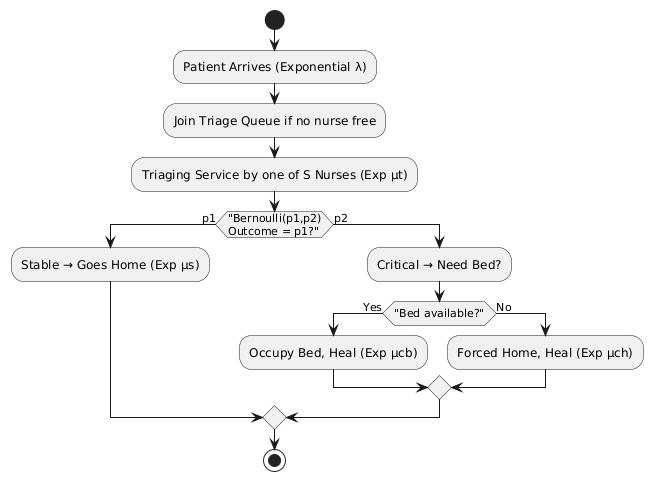

### Duran Kaan Altın-2020400108
### Muhammet Emin Çiftçi-2020400081


# **IE306 HW1**
# **Part 1.1**

## **1. Conceptual Model**

We have a hospital system where patients arrive according to an exponential interarrival process with rate \(\lambda\). Each patient must be evaluated by one of \(S\) triage nurses. After triage:

1. With probability \(p_1\), the patient is found stable (s), given home-care instructions, and sent home.  
2. With probability \(p_2 = 1 - p_1\), the patient is found critical (c) and requires a hospital bed.  
   - If a bed is available (among \(K\) beds), the patient is admitted.  
   - If no bed is available, the patient is **forced** to go home and self-treat anyway (but will likely recover slower).

Once at home, either stable or critical (but rejected), the patient recovers at home. Once in a hospital bed, a critical patient recovers in-hospital. After recovery, the patient leaves the system.

### **Key Points of the Conceptual Model**

- **Arrival process**: Exponential with rate \(\lambda\).  
- **Triage stage**: \(S\) nurses, each with exponential service time with rate \(\mu_t\). Patients can queue if no nurse is free.  
- **Hospital admission**: \(K\) beds. If all are occupied, critical patients are rejected to home care.  
- **Home care**:  
  - Stable patients: Exponential healing time, rate \(\mu_s\).  
  - Critical rejected patients: Exponential healing time, rate \(\mu_{ch}\).  
    - The time at home for a critical patient is \(\alpha\) times longer on average than a critical patient in a bed, where \(\alpha \sim \text{Uniform}[1.25,\,1.75]\).  
- **In-hospital care (for critical patients)**: Exponential healing time with rate \(\mu_{cb}\).  
- **System exits**: After healing (either at home or hospital), patients leave the system.

---

## **2. Entities**

1. **Patients**  
   - **Attributes**: 
     - Condition (stable \(s\) vs. critical \(c\))  
     - Current location (in triage queue, being served by triage nurse, home, hospital)  
     - Service/healing rate (depends on whether at home or in hospital)  
   - **Relevant random values**:
     - \(\alpha\) (only needed if the patient ends up critical but at home)

2. **Triage Nurses**  
   - \(S\) parallel resources.  
   - Service rate \(\mu_t\).  
   - Attribute: “busy” or “idle.”  

3. **Hospital Beds**  
   - \(K\) identical resources.  
   - Occupied or free.  

---

## **3. Events**

1. **Arrival**: A new patient arrives to the triage queue (time between arrivals ~ Exp(\(\lambda\))).  
2. **Departure from Triage**: A patient finishes triage with one of the nurses.  
   - Immediately decides: stable \((p_1)\) → home, or critical \((p_2)\) → tries to get a bed.  
3. **Admission Decision**: (Within the same instant as triage departure if the patient is critical.)  
   - If a bed is free, the patient is admitted.  
   - Else, the patient is forced to go home.  
4. **Discharge from Hospital**: A patient in a bed finishes service (time ~ Exp(\(\mu_{cb}\))).  
5. **Recovery at Home**: A patient at home (stable or critical) finishes healing (time ~ Exp(\(\mu_s\)) for stable or Exp(\(\mu_{ch}\)) for critical-with-\(\alpha\) factor).

---

## **4. Activities and Delays**

- **Activities**:  
  1. **Triage**: An exponential service (rate \(\mu_t\)).  
  2. **In-Hospital Healing**: An exponential service (rate \(\mu_{cb}\)).  
  3. **Home-Care Healing**: Exponential service with rate \(\mu_s\) (for stable) or \(\mu_{ch}\) (for critical forced to go home).

- **Delays**:  
  1. **Waiting for Triage Nurse**: If all \(S\) nurses are busy, the patient waits in the triage queue.  
  2. **Waiting for Hospital Bed**: In this model, if all \(K\) beds are busy at the time of admission, the critical patient is immediately turned away (“lost” to home). There is no “bed queue.”  

---

## **5. System States of Interest**

- \(N_t\): Number of patients waiting in the **triage queue** (queue length).  
- \(B_t\): Number of **busy triage nurses** (out of \(S\)).  
- \(C_t\): Number of **occupied beds** (out of \(K\)).  
- Statistics derived from states:  
  - The **utilization** of triage nurses (\(\rho_{\text{nurse}}\)).  
  - The **blocking probability** for critical patients (i.e., the fraction who cannot get a bed).  
  - The **number of patients at home** (could be broken down by stable vs. critical).  
  - The **queue length** at triage, and so on.

---

## **6. Random Variables and Distributions**

1. **Interarrival Times** \(\sim \text{Exp}(\lambda)\)  
2. **Triage Service Time** \(\sim \text{Exp}(\mu_t)\)  
3. **In-Hospital Healing Time** (for critical patients in a bed) \(\sim \text{Exp}(\mu_{cb})\)  
4. **Home Healing Time**  
   - Stable condition: \(\sim \text{Exp}(\mu_s)\)  
   - Critical but no bed: \(\sim \text{Exp}(\mu_{ch})\)  
     - Where \(\mu_{ch} = \mu_{cb}/\alpha\) if \(\alpha\) is the factor that scales the mean service time. Or you can sample \(\alpha \sim U[1.25,1.75]\) then compute the final exponential rate for that patient.  
5. **Condition** (stable vs. critical) is a Bernoulli trial with parameters \(p_1\) and \(p_2\).

---

## **7. Flowchart**

Below is a high-level flowchart showing the patient lifecycle. 



---

## **8. Pseudocode for the Discrete-Event Simulation**

**High-level steps** (event-based simulation with a Future Event List (FEL)):

1. **Initialize**:
   ```
   Clock = 0
   FEL = empty
   NumberInTriageQueue = 0
   BusyNurses = 0
   OccupiedBeds = 0
   Generate first Arrival event time (Clock + Exp(λ)) and add to FEL
   ```

2. **Main Loop**: While simulation not terminated:
   ```
   1. Remove the earliest event from FEL → (NextEvent, NextEventTime)
   2. Advance Clock to NextEventTime
   3. Execute the event routine based on the event type:
      - Arrival()
      - DepartureTriage()
      - DischargeHospital()
      - RecoveryHome()   <-- if you explicitly track “finishes at home”
   4. Update any statistics (time-average or counters) as needed
   5. Repeat
   ```

### **Event Routines** 

- **Arrival()**  
  ```
  1. A new patient arrives.
  2. If BusyNurses < S:
       - BusyNurses += 1
       - Schedule a DepartureTriage event at Clock + Exp(μt) 
         (attach patient info)
     Else:
       - NumberInTriageQueue += 1
  3. Generate next arrival time = Clock + Exp(λ) and add to FEL
  ```

- **DepartureTriage()**  
  ```
  1. The triage service for a patient finishes.
  2. If NumberInTriageQueue > 0:
       - NumberInTriageQueue -= 1
       - Schedule a new DepartureTriage event at Clock + Exp(μt) 
         (for the next patient in queue)
     Else:
       - BusyNurses -= 1
  3. Determine if patient is stable (with prob p1) or critical (p2).
  4. If stable:
       - Schedule RecoveryHome event at Clock + Exp(μs).
     If critical:
       - If OccupiedBeds < K:
           OccupiedBeds += 1
           Schedule DischargeHospital event at Clock + Exp(μcb)
         Else:
           - Rejected patient → forced home
           - Generate α ~ U[1.25,1.75]
           - Effective rate = μ_cb / α  (or however you define μ_ch)
           - Schedule RecoveryHome event at Clock + Exp(μ_ch)
  ```

- **DischargeHospital()**  
  ```
  1. A critical patient finishes treatment in a hospital bed.
  2. OccupiedBeds -= 1
  3. Patient leaves the system (record final stats if needed).
  ```

- **RecoveryHome()**  
  ```
  1. A patient (stable or forced-home critical) finishes healing at home.
  2. Patient leaves the system (record final stats if needed).
  ```

---

## **9. Stationary Analysis (Queueing Network)**

1. **Triage**: \(S\)-server M/M/S queue.  
   - Arrival rate: \(\lambda\).  
   - Service rate: \(\mu_t\).  
   - Key metrics (in standard M/M/S notation):  
     - Utilization per nurse: \(\rho = \frac{\lambda}{S\,\mu_t}\)  
     - Probability all nurses busy, average queue length, etc. (can use standard Erlang-C or M/M/S formulas).

2. **Hospital**: M/M/K/K system (also called “Erlang-loss” or “Erlang-B” model) for the critical fraction.  
   - Arrival rate: \(\lambda_{c} = \lambda \, p_2\).  
   - Service rate: \(\mu_{cb}\).  
   - Probability of blocking (no free bed):  
     \[
       B = \text{ErlangB}\bigl(K,\ \frac{\lambda_c}{\mu_{cb}}\bigr)
       \;=\;
       \frac{\left(\frac{\lambda_c}{\mu_{cb}}\right)^K / K!}{\sum_{n=0}^K \,\left(\frac{\lambda_c}{\mu_{cb}}\right)^n / n!}.
     \]
   - That is also the **rejection probability** for critical patients.

3. **Home-care**: M/M/∞ type service (no queue), or you can consider it simply an exponential “outside” the system.  
   - The fraction of stable patients is \(p_1\).  
   - The fraction of critical patients that get a bed is \((1 - B)p_2\).  
   - The fraction of critical patients rejected to home is \(B\,p_2\).

From these, you can derive:

- **Average utilization of nurses**: \(\rho_{\text{nurse}} = \frac{\lambda}{S\mu_t}\).  
- **Average queue length at triage**: use M/M/S formula for \(L_q\).  
- **Rejection probability** of critical patients: \(B\).  
- **Average number of occupied beds**: 
  \[
    \text{(arrival rate of admitted patients)} \times \text{(mean service time)} 
    \;=\; (\lambda\,p_2\, (1-B)) \times \frac{1}{\mu_{cb}}.
  \]
- **Average number of patients treated at home**: 
  \[
    \lambda \, p_1 \;+\; \lambda\,p_2\,B 
    = \lambda \left[p_1 + p_2\,B\right].
  \]

---

# **Part 2.1**

Below is a **step-by-step hand-simulation** for **Part 2.1** using our project parameters and **seed=4040800189**, stopping once **5 patients** have been fully healed.

---

# **1. Random Draws (Seed=4040800189)**

Using a snippet like:
```python
import random
random.seed(4040800189)

# We'll just show the first 5 draws in each category (enough for 5 patients).
inter_arrivals = [random.expovariate(1.0) for _ in range(5)]
triage_times   = [random.expovariate(0.476190476) for _ in range(5)]
is_stable      = [random.random() for _ in range(5)]  # to decide stable vs. critical
hospital_times = [random.expovariate(0.118518519) for _ in range(5)]
stable_times   = [random.expovariate(0.16) for _ in range(5)]
```

we get this:

1. **Interarrival times** (Exp(1.0)) for the first 5 arrivals:  
   - \(A_1 = 2.976\)  
   - \(A_2 = 0.6614\)  
   - \(A_3 = 1.6735\)  
   - \(A_4 = 0.2868\)  
   - \(A_5 = 1.1872\)  

   (So the arrival times will be:  
   - P1 at 2.976  
   - P2 at 2.976 + 0.6614 = 3.6374  
   - P3 at 3.6374 + 1.6735 = 5.3109  
   - P4 at 5.3109 + 0.2868 = 5.5977  
   - P5 at 5.5977 + 1.1872 = 6.7849)

2. **Triage times** (Exp(0.476190476)):  
   - P1: 1.1826  
   - P2: 2.0448  
   - P3: 0.9115  
   - P4: 1.8633  
   - P5: 0.3142  

3. **is_stable_randoms** (Uniform(0,1)) to decide stable vs. critical:  
   - P1: 0.4541 → >0.2 → critical  
   - P2: 0.4358 → >0.2 → critical  
   - P3: 0.7336 → >0.2 → critical  
   - P4: 0.8607 → >0.2 → critical  
   - P5: 0.0260 → ≤0.2 → stable  

4. **Hospital times** (Exp(0.118518519)) for critical patients:  
   - P1: 12.8249  
   - P2: 0.6268  
   - P3: 5.5226  
   - P4: 13.9519  
   - P5: 2.2053  (not needed if P5 is stable, but we list it)

5. **Stable home-care times** (Exp(0.16)) for stable patients:  
   - P1: 5.7986  
   - P2: 19.0437  
   - P3: 0.0660  
   - P4: 7.2421  
   - P5: 10.4462  (this is the relevant one, since P5 turned out stable)

We have:
- \(\lambda = 1\)
- \(\mu_t = 0.476190476\)
- \(\mu_s = 0.16\)
- \(\mu_{cb} = 0.118518519\)
- \(p_1 = 0.2\), \(p_2 = 0.8\)
- \(S=3\) triage nurses, \(K=9\) beds

*No forced-home critical is likely, since \(K=9\) is plenty for 5 patients.*

---

# **2. Step-by-Step Simulation Table**

We run until **5 patients** finish (are “healed”). Key system state variables:  
- **TQ**: # waiting in triage queue  
- **BN**: # busy nurses (out of 3)  
- **OB**: # occupied beds (out of 9)  

## **Initialization**

- **Clock = 0**  
- TQ=0, BN=0, OB=0 (empty system)  
- **FEL** = { (2.976, Arrival, P1) }

---

### **Event 1**: (2.976, Arrival of Patient #1)

1. Clock → 2.976  
2. BN=0 < 3 → P1 goes directly to triage → BN=1, TQ=0  
3. Schedule next arrival: 2.976 + 0.6614 = 3.6374 → (3.6374, Arrival, P2)  
4. Triage time (P1): 1.1826 → departure triage at 2.976 + 1.1826 = 4.1586  
5. **FEL** = {(3.6374, Arrival, P2), (4.1586, DepartureTriage, P1)}

| Clock | Event             | FEL                                                | TQ | BN | OB | Comments                  |
|-------|-------------------|----------------------------------------------------|----|----|----|---------------------------|
| 0.000 | Start (No event) | {(2.976, Arr, P1)}                                 | 0  | 0  | 0  | System empty             |
| 2.976 | **Arr(P1)**      | {(3.6374,Arr,P2),(4.1586,DepT,P1)}                 | 0  | 1  | 0  | P1 triage started        |

---

### **Event 2**: (3.6374, Arrival of Patient #2)

1. Clock → 3.6374  
2. BN=1<3 → P2 enters triage → BN=2, TQ=0  
3. Next arrival: 3.6374 + 1.6735 = 5.3109 → (5.3109, Arrival, P3)  
4. Triage time (P2): 2.0448 → departure triage = 3.6374 + 2.0448 = 5.6822  
5. **FEL** = {(4.1586,DepT,P1), (5.3109,Arr,P3), (5.6822,DepT,P2)}

| Clock  | Event             | FEL                                                          | TQ | BN | OB | Comments           |
|--------|-------------------|--------------------------------------------------------------|----|----|----|--------------------|
| 3.6374 | **Arr(P2)**       | {(4.1586,DepT,P1),(5.3109,Arr,P3),(5.6822,DepT,P2)}          | 0  | 2  | 0  | P2 triage started  |

---

### **Event 3**: (4.1586, DepartureTriage, P1)

1. Clock → 4.1586  
2. BN=2 → BN=1 (queue=0)  
3. Check stable vs. critical for P1: stable draw=0.4541 → >0.2 → **critical**  
4. Beds? OB=0 < 9 → P1 goes to bed → OB=1  
   - Hospital time=12.8249 → discharge=4.1586 + 12.8249 = 16.9835  
5. **FEL** = {(5.3109,Arr,P3),(5.6822,DepT,P2),(16.9835,TreatedAtHospital,P1)}

| Clock  | Event                  | FEL                                                                  | TQ | BN | OB | Comments                       |
|--------|------------------------|----------------------------------------------------------------------|----|----|----|--------------------------------|
| 4.1586 | **DepT(P1)**          | {(5.3109,Arr,P3),(5.6822,DepT,P2),(16.9835,TAH,P1)}                   | 0  | 1  | 1  | P1 is critical; bed #1 in use. |

---

### **Event 4**: (5.3109, Arrival, P3)

1. Clock → 5.3109  
2. BN=1<3 → P3 immediately starts triage → BN=2  
3. Next arrival= 5.3109 + 0.2868= 5.5977 → (5.5977, Arr, P4)  
4. Triage time P3= 0.9115 → finishes=5.3109 +0.9115=6.2224  
5. **FEL**= {(5.5977,Arr,P4),(5.6822,DepT,P2),(6.2224,DepT,P3),(16.9835,TAH,P1)}

| Clock  | Event             | FEL                                                                                 | TQ | BN | OB | Comments                |
|--------|-------------------|-------------------------------------------------------------------------------------|----|----|----|-------------------------|
| 5.3109 | **Arr(P3)**       | {(5.5977,Arr,P4),(5.6822,DepT,P2),(6.2224,DepT,P3),(16.9835,TAH,P1)}                 | 0  | 2  | 1  | P3 in triage            |

---

### **Event 5**: (5.5977, Arrival, P4)

1. Clock → 5.5977  
2. BN=2<3 → P4 starts triage → BN=3  
3. Next arrival=5.5977 +1.1872= 6.7849 → (6.7849, Arr, P5)  
4. Triage time P4=1.8633 → dep triage=5.5977+1.8633=7.461  
5. **FEL**= {(5.6822,DepT,P2),(6.2224,DepT,P3),(6.7849,Arr,P5),(7.461,DepT,P4),(16.9835,TAH,P1)}

| Clock  | Event             | FEL                                                                                                | TQ | BN | OB | Comments                  |
|--------|-------------------|----------------------------------------------------------------------------------------------------|----|----|----|---------------------------|
| 5.5977 | **Arr(P4)**       | {(5.6822,DepT,P2),(6.2224,DepT,P3),(6.7849,Arr,P5),(7.461,DepT,P4),(16.9835,TAH,P1)}               | 0  | 3  | 1  | P4 in triage (all 3 busy) |

---

### **Event 6**: (5.6822, DepartureTriage, P2)

1. Clock → 5.6822  
2. BN=3→2  
3. P2 stable vs. critical? is_stable[1] =0.4358→>0.2→**critical**  
4. OB=1<9→ P2 gets a bed → OB=2  
   - Hospital time=0.6268→ discharge=5.6822+0.6268=6.309  
5. **FEL**= {(6.2224,DepT,P3),(6.309,TAH,P2),(6.7849,Arr,P5),(7.461,DepT,P4),(16.9835,TAH,P1)}

| Clock  | Event                | FEL                                                                                                  | TQ | BN | OB | Comments                           |
|--------|----------------------|------------------------------------------------------------------------------------------------------|----|----|----|------------------------------------|
| 5.6822 | **DepT(P2)**        | {(6.2224,DepT,P3),(6.309,TAH,P2),(6.7849,Arr,P5),(7.461,DepT,P4),(16.9835,TAH,P1)}                    | 0  | 2  | 2  | P2 is critical; bed #2 in use now. |

---

### **Event 7**: (6.2224, DepartureTriage, P3)

1. Clock → 6.2224  
2. BN=2→1 (queue=0)  
3. P3 stable vs. critical? is_stable[2]=0.7336→>0.2→**critical**  
4. OB=2<9→ P3 admitted → OB=3  
   - hospital time=5.5226→ discharge=6.2224+5.5226=11.745  
5. **FEL**= {(6.309,TAH,P2),(6.7849,Arr,P5),(7.461,DepT,P4),(11.745,TAH,P3),(16.9835,TAH,P1)}

| Clock  | Event                | FEL                                                                                           | TQ | BN | OB | Comments                        |
|--------|----------------------|-----------------------------------------------------------------------------------------------|----|----|----|---------------------------------|
| 6.2224 | **DepT(P3)**        | {(6.309,TAH,P2),(6.7849,Arr,P5),(7.461,DepT,P4),(11.745,TAH,P3),(16.9835,TAH,P1)}              | 0  | 1  | 3  | P3 is critical; bed #3 in use.  |

---

### **Event 8**: (6.309, TreatedAtHospital, P2)

1. Clock → 6.309  
2. P2 done → OB=3→2  
3. This is our **1st** patient fully healed.  

**FEL**= {(6.7849,Arr,P5),(7.461,DepT,P4),(11.745,TAH,P3),(16.9835,TAH,P1)}

| Clock  | Event                      | FEL                                                                                       | TQ | BN | OB | Comments                 |
|--------|----------------------------|-------------------------------------------------------------------------------------------|----|----|----|--------------------------|
| 6.309  | **TreatedAtHospital(P2)** | {(6.7849,Arr,P5),(7.461,DepT,P4),(11.745,TAH,P3),(16.9835,TAH,P1)}                         | 0  | 1  | 2  | **1st** patient healed. |

---

### **Event 9**: (6.7849, Arrival, P5)

1. Clock → 6.7849  
2. BN=1<3 → P5 enters triage → BN=2  
3. Next arrival is not needed for the first 5 patients, so we ignore or skip it.  
4. Triage time(P5)=0.3142 → finish=6.7849+0.3142=7.0991  
5. **FEL**= {(7.0991,DepT,P5),(7.461,DepT,P4),(11.745,TAH,P3),(16.9835,TAH,P1)}

| Clock  | Event               | FEL                                                                                            | TQ | BN | OB | Comments          |
|--------|---------------------|------------------------------------------------------------------------------------------------|----|----|----|-------------------|
| 6.7849 | **Arr(P5)**         | {(7.0991,DepT,P5),(7.461,DepT,P4),(11.745,TAH,P3),(16.9835,TAH,P1)}                           | 0  | 2  | 2  | P5 in triage      |

---

### **Event 10**: (7.0991, DepartureTriage, P5)

1. Clock → 7.0991  
2. BN=2→1  
3. P5 stable vs. critical? is_stable[4]=0.0260 → ≤0.2 → **stable**  
4. So P5 goes home: stable_home_time=10.4462 → finishing=7.0991+10.4462=17.5453  
5. **FEL**= {(7.461,DepT,P4),(11.745,TAH,P3),(16.9835,TAH,P1),(17.5453,RecoveryHome,P5)}

| Clock  | Event                | FEL                                                                                         | TQ | BN | OB | Comments                                   |
|--------|----------------------|---------------------------------------------------------------------------------------------|----|----|----|--------------------------------------------|
| 7.0991 | **DepT(P5)**         | {(7.461,DepT,P4),(11.745,TAH,P3),(16.9835,TAH,P1),(17.5453,RH,P5)}                          | 0  | 1  | 2  | P5 stable → finishing home at 17.5453      |

---

### **Event 11**: (7.461, DepartureTriage, P4)

1. Clock → 7.461  
2. BN=1→0  
3. stable vs. critical for P4? is_stable[3]=0.8607→>0.2→**critical**  
4. OB=2<9→ P4 admitted → OB=3  
   - hospital time=13.9519 → finishing=7.461+13.9519=21.4129  
5. **FEL**= {(11.745,TAH,P3),(16.9835,TAH,P1),(17.5453,RH,P5),(21.4129,TAH,P4)}

| Clock  | Event                | FEL                                                                                     | TQ | BN | OB | Comments                              |
|--------|----------------------|-----------------------------------------------------------------------------------------|----|----|----|---------------------------------------|
| 7.461  | **DepT(P4)**         | {(11.745,TAH,P3),(16.9835,TAH,P1),(17.5453,RH,P5),(21.4129,TAH,P4)}                     | 0  | 0  | 3  | P4 critical → bed #3 now in use.      |

---

### **Event 12**: (11.745, TreatedAtHospital, P3)

1. Clock → 11.745  
2. OB=3→2  
3. P3 is the **2nd** patient to finish.  

**FEL**= {(16.9835,TAH,P1),(17.5453,RH,P5),(21.4129,TAH,P4)}

| Clock  | Event                      | FEL                                                             | TQ | BN | OB | Comments                   |
|--------|----------------------------|-----------------------------------------------------------------|----|----|----|----------------------------|
| 11.745 | **TreatedAtHospital(P3)** | {(16.9835,TAH,P1),(17.5453,RH,P5),(21.4129,TAH,P4)}              | 0  | 0  | 2  | **2nd** patient finished. |

---

### **Event 13**: (16.9835, TreatedAtHospital, P1)

1. Clock → 16.9835  
2. OB=2→1  
3. P1 is the **3rd** patient finished.  

**FEL**= {(17.5453,RH,P5),(21.4129,TAH,P4)}

| Clock  | Event                      | FEL                                            | TQ | BN | OB | Comments                  |
|--------|----------------------------|------------------------------------------------|----|----|----|---------------------------|
| 16.9835| **TreatedAtHospital(P1)** | {(17.5453,RH,P5),(21.4129,TAH,P4)}             | 0  | 0  | 1  | **3rd** patient finished. |

---

### **Event 14**: (17.5453, RecoveryHome, P5)

1. Clock → 17.5453  
2. P5 finishes stable home-care. OB=1 remains for P4  
3. P5 is the **4th** patient done.  

**FEL**= {(21.4129,TAH,P4)}

| Clock  | Event                       | FEL                          | TQ | BN | OB | Comments                 |
|--------|-----------------------------|------------------------------|----|----|----|--------------------------|
| 17.5453| **RecoveryHome(P5)**       | {(21.4129,TAH,P4)}           | 0  | 0  | 1  | **4th** patient finished |

---

### **Event 15**: (21.4129, TreatedAtHospital, P4)

1. Clock → 21.4129  
2. OB=1→0  
3. P4 is the **5th** patient done → **stop** the simulation.  

| Clock  | Event                       | FEL      | TQ | BN | OB | Comments                          |
|--------|-----------------------------|----------|----|----|----|-----------------------------------|
| 21.4129| **TreatedAtHospital(P4)**  | {}       | 0  | 0  | 0  | **5th** patient finished → Stop.  |

---

# **3. Order & Times of Completion**

1. **P2** finishes first at time = **6.309**  
2. **P3** finishes second at time = **11.745**  
3. **P1** finishes third at time = **16.9835**  
4. **P5** finishes fourth at time = **17.5453** (stable home-care)  
5. **P4** finishes fifth at time = **21.4129**  

Hence we stop at time 21.4129 once the 5th patient is healed.

---

## **Comments on Results**

1. **Rejections?** None, because with \(K=9\) beds we never ran out of capacity.  
2. **Stable vs. Critical?** Among these first 5 arrivals, only P5 turned out stable (since is_stable=0.026 ≤ 0.2). The other 4 were critical.  
3. **Longest time** in system is P4 (21.41 hours). P4 got an unlucky large hospital time (13.9519).  
4. **Earliest finishing** was P2 at 6.309 hours (very short hospital time of 0.6268).  
5. **Queueing?** Only P5 briefly waited in triage at event 6.7849 → 3 nurses were busy at that point, so TQ=1.

---

# **Part 2.2 Simulation Results**

This section presents the **model responses** requested in the homework for each of the **three starting conditions**:  
1. **Empty system**  
2. **Half-full** (half of the nurses and half of the beds occupied at time zero)  
3. **Full** (all nurses and all beds occupied at time zero)

We run the simulation until we have:  
- **20 healed patients**  
- **200 healed patients**  
- **1000 healed patients**  

using the **same random number seed**. Additionally, we provide **20 replications** for the **200 healed patients** scenario to generate confidence intervals.

---

## **1. Model Responses**

Below is the list of performance metrics we must report for each run:

1. **Long-run marginal probability triage is empty**  
2. **Long-run marginal probability beds are empty**  
3. **Long-run marginal probability both are empty**  
4. **Proportion of critical patients rejected** (due to bed unavailability)  
5. **Average utilization** of each triage nurse  
6. **Average number of occupied beds** in the hospital  
7. **Proportion of patients that are treated at home**  
8. **Average time a sick person gets better**  

---

## **2. Results for Each Condition and Run Length**

### **2.1 Empty System**

We start the system with no patients in queue, no nurses occupied, and no beds occupied.

#### **2.1.1. 20 Healed Patients**  

| Performance Metric                                     | Value  |
|--------------------------------------------------------|--------|
| Probability triage empty                               | 0.277       |
| Probability beds empty                                 | 0.149       |
| Probability both empty                                 | 0.086       |
| Proportion of critical patients rejected               | 0.000       |
| Average utilization of each triage nurse               | 0.449       |
| Average number of occupied beds                        | 3.601       |
| Proportion of patients treated at home                 | 0.179       |
| Average time a sick person gets better                 | 7.688       |

**Discussion**:  
- Only 20 patients means higher variability. Triage is empty 27.7% of the time and beds 14.9%, with no rejections. Nurse utilization is modest (0.449), reflecting relatively light usage in such a short run. The average time to recover is about 7.69 hours, indicating little queueing or delays so early.

#### **2.1.2. 200 Healed Patients**  

| Performance Metric                                     | Value  |
|--------------------------------------------------------|--------|
| Probability triage empty                               | 0.101       |
| Probability beds empty                                 | 0.025       |
| Probability both empty                                 | 0.014       |
| Proportion of critical patients rejected               | 0.085       |
| Average utilization of each triage nurse               | 0.763       |
| Average number of occupied beds                        | 5.448       |
| Proportion of patients treated at home                 | 0.294       |
| Average time a sick person gets better                 | 8.997       |

**Discussion**:  
- At 200 patients, the system is busier. Triage is empty only 10.1% and beds 2.5%. Some critical patients get rejected (8.5%), and nurse utilization rises to 0.763. The average recovery time increases to nearly 9 hours, highlighting more congestion than in the 20-patient run.

#### **2.1.3. 1000 Healed Patients**  

| Performance Metric                                     | Value  |
|--------------------------------------------------------|--------|
| Probability triage empty                               | 0.109       |
| Probability beds empty                                 | 0.007       |
| Probability both empty                                 | 0.003       |
| Proportion of critical patients rejected               | 0.115       |
| Average utilization of each triage nurse               | 0.709       |
| Average number of occupied beds                        | 6.037       |
| Proportion of patients treated at home                 | 0.296       |
| Average time a sick person gets better                 | 10.547      |

**Discussion**:  
- Longer run (1000 patients) sees triage empty 10.9%, beds empty 0.7%, and rejections at 11.5%. Nurse utilization dips a bit to 0.709, though average bed occupancy is around six. Recovery time exceeds 10 hours, reflecting heavier, more sustained load.

---

### **2.2 Half-Full System**

We start the system with approximately half of the nurses and half the beds **already** occupied at time zero, each with a randomly scheduled departure event.

#### **2.2.1. 20 Healed Patients**  

| Performance Metric                                     | Value  |
|--------------------------------------------------------|--------|
| Probability triage empty                               | 0.137       |
| Probability beds empty                                 | 0.000       |
| Probability both empty                                 | 0.000       |
| Proportion of critical patients rejected               | 0.056       |
| Average utilization of each triage nurse               | 0.597       |
| Average number of occupied beds                        | 6.014       |
| Proportion of patients treated at home                 | 0.230       |
| Average time a sick person gets better                 | 7.915       |

**Discussion**:  
- Starting half-full means beds are almost never empty early on. Rejections appear at 5.6%, nurse utilization is 0.597, and average recovery is ~7.92 hours—slightly higher than the empty 20-patient case but still fairly transient.

#### **2.2.2. 200 Healed Patients**  

| Performance Metric                                     | Value  |
|--------------------------------------------------------|--------|
| Probability triage empty                               | 0.075       |
| Probability beds empty                                 | 0.000       |
| Probability both empty                                 | 0.000       |
| Proportion of critical patients rejected               | 0.087       |
| Average utilization of each triage nurse               | 0.796       |
| Average number of occupied beds                        | 5.959       |
| Proportion of patients treated at home                 | 0.297       |
| Average time a sick person gets better                 | 9.153       |

**Discussion**:  
- With 200 patients, the half-full system starts resembling the empty scenario after some time. Beds remain in constant use (0% empty), and the rejection rate is 8.7%. Nurse utilization is high (0.796), with an average recovery time of 9.15 hours—close to the empty system’s 9.0.

#### **2.2.3. 1000 Healed Patients**  

| Performance Metric                                     | Value  |
|--------------------------------------------------------|--------|
| Probability triage empty                               | 0.104       |
| Probability beds empty                                 | 0.001       |
| Probability both empty                                 | 0.0001      |
| Proportion of critical patients rejected               | 0.117       |
| Average utilization of each triage nurse               | 0.715       |
| Average number of occupied beds                        | 6.150       |
| Proportion of patients treated at home                 | 0.298       |
| Average time a sick person gets better                 | 10.588      |

**Discussion**:  
- By 1000 patients, triage empty time (10.4%) and rejections (11.7%) closely match the empty system. Nurse utilization is 0.715, and average recovery reaches 10.59 hours, again aligning well with the empty case. The system “forgets” its half-full start.

---

### **2.3 Fully Full System**

We start the system with all nurses occupied and all beds occupied at time zero, each having a random completion event.

#### **2.3.1. 20 Healed Patients**  

| Performance Metric                                     | Value  |
|--------------------------------------------------------|--------|
| Probability triage empty                               | 0.250       |
| Probability beds empty                                 | 0.000       |
| Probability both empty                                 | 0.000       |
| Proportion of critical patients rejected               | 0.133       |
| Average utilization of each triage nurse               | 0.413       |
| Average number of occupied beds                        | 5.308       |
| Proportion of patients treated at home                 | 0.167       |
| Average time a sick person gets better                 | 5.985       |

**Discussion**:  
- Full at the start causes immediate rejections (13.3%), but nurse utilization for this short run is just 0.413, and triage is empty 25% of the time, reflecting quick departure of the initial “dummy” patients. Average recovery time is only 5.99 hours—some quick completions freed capacity relatively fast.

#### **2.3.2. 200 Healed Patients**  

| Performance Metric                                     | Value  |
|--------------------------------------------------------|--------|
| Probability triage empty                               | 0.084       |
| Probability beds empty                                 | 0.000       |
| Probability both empty                                 | 0.000       |
| Proportion of critical patients rejected               | 0.083       |
| Average utilization of each triage nurse               | 0.777       |
| Average number of occupied beds                        | 5.486       |
| Proportion of patients treated at home                 | 0.292       |
| Average time a sick person gets better                 | 8.754       |

**Discussion**:  
- After 200 patients, the full initial load matters less. Rejections drop to 8.3%, with nurse utilization at 0.777. Triage empties 8.4% of the time. The system essentially converges to similar behavior as the empty/half starts, and average recovery is 8.75 hours

#### **2.3.3. 1000 Healed Patients**  

| Performance Metric                                     | Value  |
|--------------------------------------------------------|--------|
| Probability triage empty                               | 0.106       |
| Probability beds empty                                 | 0.001       |
| Probability both empty                                 | 0.0001      |
| Proportion of critical patients rejected               | 0.118       |
| Average utilization of each triage nurse               | 0.710       |
| Average number of occupied beds                        | 6.083       |
| Proportion of patients treated at home                 | 0.299       |
| Average time a sick person gets better                 | 10.519      |

**Discussion**:  
- At 1000 patients, triage is empty ~10.6%, rejections ~11.8%, and average time ~10.52 hours—near identical to the other scenarios. Full initial loading thus loses significance in the long run.

---

## **3. 20 Replications for 200 Healed Patients**

For **confidence intervals**, we perform **20 independent replications** (using different random seeds) for the case of **200 healed patients**. Here we present the **mean** value for each metric, along with its **95% confidence interval**. We do this for each initial condition (`empty`, `half`, `full`).

### **3.1. Empty System, 20 Replications for 200 Healed Patients**

| Performance Metric                          | Mean    | 95% CI (Lower) | 95% CI (Upper) |
|--------------------------------------------|---------|---------------|---------------|
| Probability triage empty                   |  0.0969 |        0.0845 |        0.1094 |
| Probability beds empty                     |  0.0166 |        0.0120 |        0.0212 |
| Probability both empty                     |  0.0066 |        0.0042 |        0.0090 |
| Proportion of critical patients rejected   |  0.0987 |        0.0838 |        0.1136 |
| Average nurse utilization                  |  0.6992 |        0.6724 |        0.7259 |
| Average number of occupied beds            |  5.7201 |        5.5613 |        5.8788 |
| Proportion of patients treated at home     |  0.2764 |        0.2597 |        0.2932 |
| Average time a sick person gets better     | 10.0167 |        9.6866 |       10.3469 |


---

### **3.2. Half-Full, 20 Replications for 200 Healed Patients**

| Performance Metric                          | Mean    | 95% CI (Lower) | 95% CI (Upper) |
|--------------------------------------------|---------|---------------|---------------|
| Probability triage empty                   |  0.1030 |        0.0830 |        0.1230 |
| Probability beds empty                     |  0.0009 |        0.0000 |        0.0019 |
| Probability both empty                     |  0.0000 |        0.0000 |        0.0000 |
| Proportion of critical patients rejected   |  0.0991 |        0.0825 |        0.1158 |
| Average nurse utilization                  |  0.6924 |        0.6550 |        0.7297 |
| Average number of occupied beds            |  5.8288 |        5.6156 |        6.0420 |
| Proportion of patients treated at home     |  0.2824 |        0.2658 |        0.2990 |
| Average time a sick person gets better     |  9.8559 |        9.6125 |       10.0993 |

---

### **3.3. Full, 20 Replications for 200 Healed Patients**

| Performance Metric                          | Mean    | 95% CI (Lower) | 95% CI (Upper) |
|--------------------------------------------|---------|---------------|---------------|
| Probability triage empty                   |  0.0921 |        0.0752 |        0.1089 |
| Probability beds empty                     |  0.0020 |       -0.0001 |        0.0041 |
| Probability both empty                     |  0.0003 |       -0.0003 |        0.0009 |
| Proportion of critical patients rejected   |  0.1125 |        0.0933 |        0.1317 |
| Average nurse utilization                  |  0.7028 |        0.6683 |        0.7373 |
| Average number of occupied beds            |  6.0385 |        5.8117 |        6.2652 |
| Proportion of patients treated at home     |  0.2952 |        0.2801 |        0.3103 |
| Average time a sick person gets better     |  9.9434 |        9.6219 |       10.2649 |

---

## **4. Comparisons & Conclusions**
- Run Length: At 20 patients, results vary a lot; by 200 or 1000, the system is more stable, with higher utilization, some rejections, and more consistent average times.

- Initial Conditions: Differences are most noticeable in short runs. By 200–1000 patients, all scenarios converge on similar metrics.

- Confidence Intervals: Twenty-rep CIs show moderate variation around the means, but not enough to contradict the overall convergent behavior.

In conclusion, the system eventually “forgets” its initial state, stabilizing around ~70–80% nurse utilization, 5–6 beds occupied on average, and ~10 hours average recovery time with ~10–12% rejections.

---

